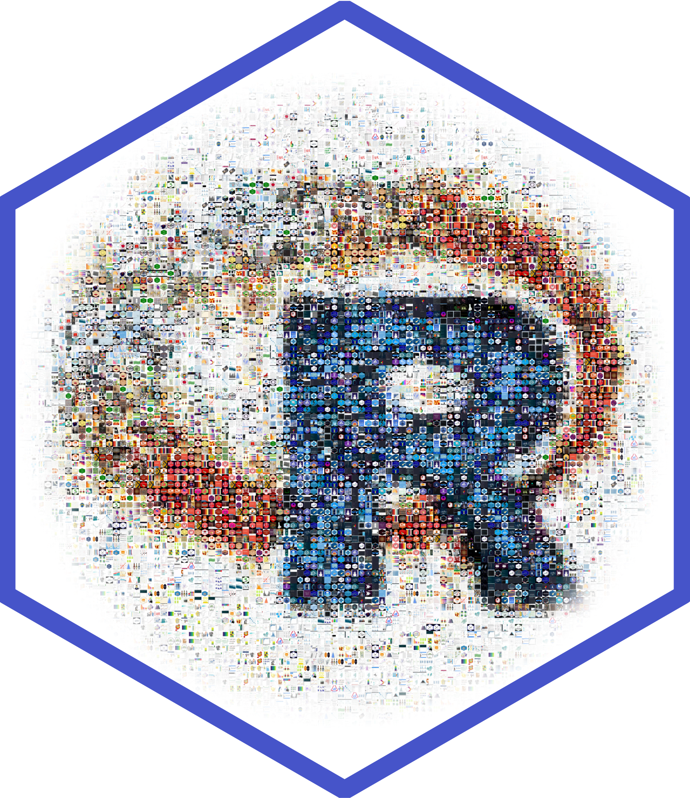

```{r setup, include=FALSE}
knitr::opts_chunk$set(echo = TRUE)
```

# R posts 

Posting and promoting recent data science content for the R community.  

<a href = 'https://twitter.com/icymi_r'></a>    <a href = 'https://www.linkedin.com/company/37469761/'></a>    <a href = 'https://www.facebook.com/R-posts-you-might-have-missed-111889387146405/'></a>

# Python posts 

Posting and promoting recent data science content for the Python community.  

<a href = 'https://twitter.com/icymi_py'></a>    <a href = 'https://www.linkedin.com/company/42419346'></a>    <a href = 'https://www.facebook.com/Python-posts-that-you-might-have-missed-102053681476903'></a>

# Comments? Suggestions? Issues?

Any feedback is welcome! Feel free to write a github issue or send me a message on [twitter](https://twitter.com/rushworth_a).

# Support this project 

<a href="https://www.buymeacoffee.com/arushworth" target="_blank"></a>


