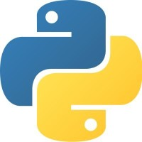

```{r setup, include=FALSE}
knitr::opts_chunk$set(echo = TRUE)
```

# About 

_R posts you might have missed!_ and _Python posts you might have missed!_ are semi-automated twitter accounts posting recent data science related content. The goal is to make it easier to keep up with the most important packages and news from the community. Links to relevant and popular resources are gathered from twitter and the wider data science blogosphere before being processed and lightly curated.  For more information about how the feed works and why it came into being, please check out [this blog post](https://alastairrushworth.github.io/R-Posts-You-Might-Have-Missed!/).

# _R posts you might have missed!_ 

You can follow along for updates on Twitter, Linkedin and Facebook:

<a href = 'https://twitter.com/icymi_r'></a>    <a href = 'https://www.linkedin.com/company/37469761/'></a>    <a href = 'https://www.facebook.com/R-posts-you-might-have-missed-111889387146405/'></a>

# _Python posts you might have missed!_ 

You can follow along for updates on Twitter, Linkedin and Facebook:

<a href = 'https://twitter.com/icymi_py'></a>    <a href = 'https://www.linkedin.com/company/42419346'></a>    <a href = 'https://www.facebook.com/Python-posts-that-you-might-have-missed-102053681476903'></a>

# Comments? Suggestions? Issues?

Any feedback is welcome! Feel free to write a github issue or send me a message on [twitter](https://twitter.com/rushworth_a).

# Support this project 

<a href="https://www.buymeacoffee.com/arushworth" target="_blank"></a>


